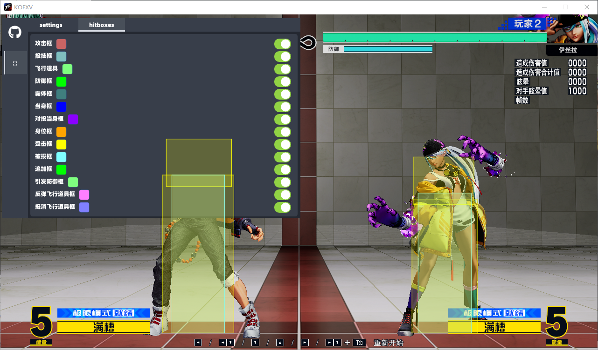
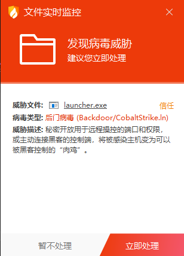

## hitbox

拳皇15判定框显示

***

### 使用

1. 在[release页 (github.com)](https://github.com/473671866/hitbox/releases/tag/release-5.1)启动游戏中下载launcher.exe
2. 启动游戏
3. 启动launcher.exe

***

### 判定框

- 攻击框
- 身体框
- 受击框
- 防御框
- 追加框
- 霸体框
- 当身框
- 投技框
- 被投框
- 触发防御框
- 抵消飞行道具框
- 反弹飞行道具框
- 投技当身框（推进打击）

***

### 更新

**2.0**

- 修复了角色位移导致攻击框显示不准的问题(江璃落子鹓)
- 新增投技框、被投框、触发防御框、抵消飞行道具框、反弹飞行道具框(江璃落子鹓)

**3.0**

- 添加透明度选项
- 使用填充矩形绘制判定框

**4.0**

- 新增一个判定框
- 修复了一些已知bug
- 通过`F1`开关窗口

**5.0**

- 新的界面

**5.1**

- 新的注入方式
- 修复seh异常

***

### 编译

Virtual Studio 2022

*****

### 关于报毒

软件本身有注入行为，所以为被会各家杀软件拦截

*****

### 感谢

感谢[小废林的个人空间-小废林个人主页-哔哩哔哩视频 (bilibili.com)](https://space.bilibili.com/2203159)的赞助

感谢[江璃落子鹓的个人空间-江璃落子鹓个人主页-哔哩哔哩视频 (bilibili.com)](https://space.bilibili.com/346699931)提供判定框数据
